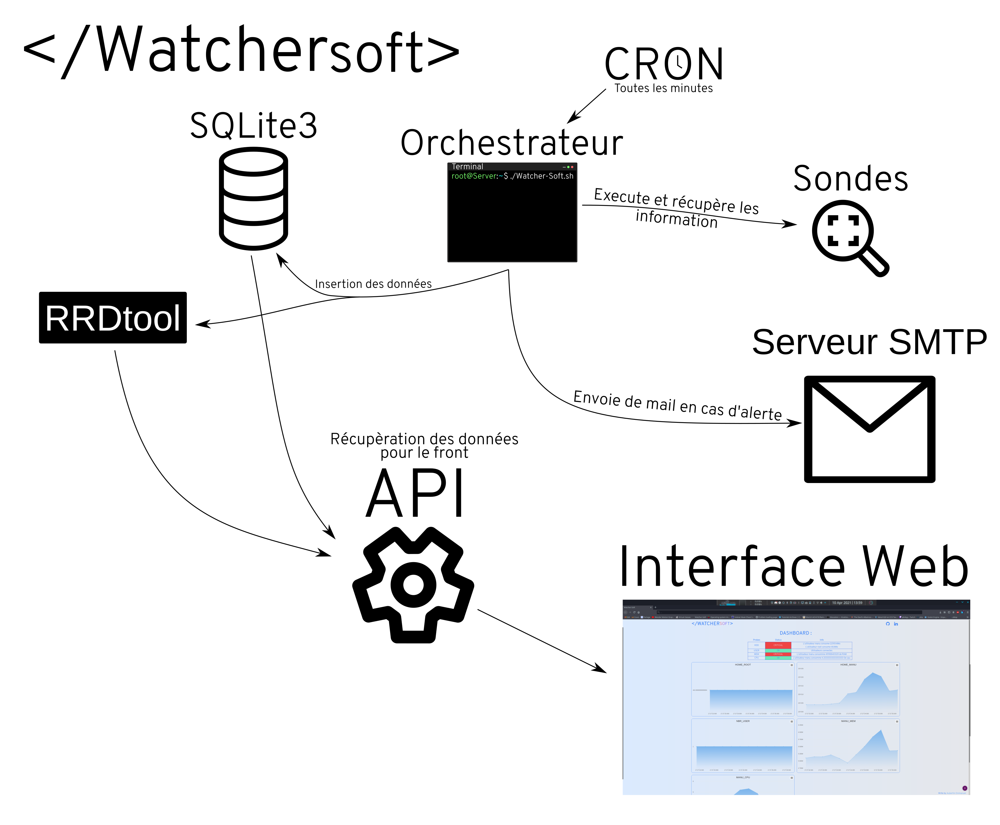
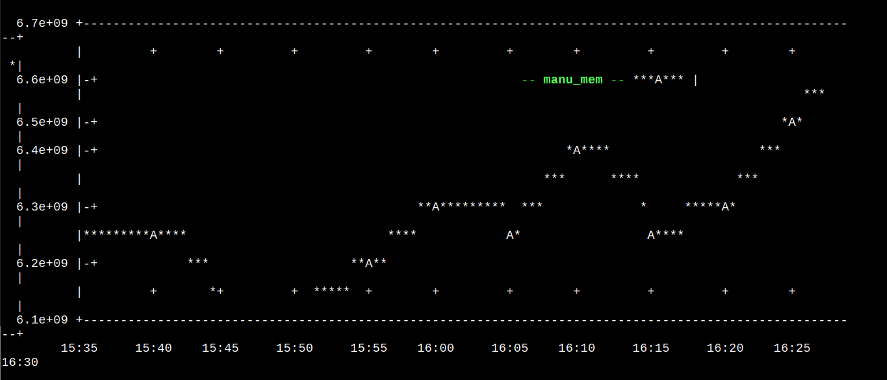

# **Watcher-Soft**

Watcher-Soft est un logiciel de monitoring pour Ubuntu serveur. Ce dernier a été développé dans le cadre d'un projet pédagogique à [l'université d'avignon](https://ceri.univ-avignon.fr/). Ce devoir est le fruit du travail d'Aubertin Emmanuel.

## **SOMMAIRE :**</br>
----
1. **[INSTALLATION](#INSTALLATION)**</br>
1. **[ARCHITECTURE](#ARCHITECTURE)**</br>
    - **[Collecte d’informations](#Collecte-d’informations)**</br>
    - **[Stockage et archivage](#Stockage-et-archivage)**</br>
    - **[Affichage](#Affichage)**</br>
    - **[Alerte](#Alerte)**</br>
    - **[Orchestrateur](#orchestrateur)**</br>
    - **[Application web](#Application-web)**</br>
1. **[Mes choix face au sujet](#Mes-choix-face-au-sujet)**

<div id='INSTALLATION'/>

## **INSTALLATION**
----

```bash
wget https://raw.githubusercontent.com/Athomisos/Watcher-soft/main/install.sh && chmod +x install.sh && sudo ./install.sh
```
<div id='ARCHITECTURE'/>  

## **ARCHITECTURE**
----


<div id='Collecte-d’informations'/>

### **Collecte d’informations**

Dans Watcher-soft la collecte d'information est faite par des sondes (probes en anglais). Elles doivent toutes etre dans [probes/](probes/) pour etre executées. Ces sondes ont des noms et des sorties semi-structurées, ce qui permet l'ajout d’une nouvelle sonde sans modification manuelle du code. Elles sont exécutées par [l'orchestrateur](#L'orchestrateur).

**Les noms :**</br>
Ils doivent être de la forme : `NOM_probe.ext`.

**Options par défaut :**</br>
La sonde doit contenir un commentaire avec les options par défaut, de faite, on a une gestion des critères de situation de crise qui sont configurables. Ce commentaire devra être de la forme suivante : 
```python
#défaut_OPTIONS=" --example 120 -Z 25"
```
 
**Les sorties :**</br>
Les sortie des sondes sont semi-structuré, elles doivent prndre la forme :
```
STATE: Message utilisateur 1, Message utilisateur 2 | DisplayName_user1=value;warning_value;critical_value DisplayName_user2=value;warning_value;critical_value
```
Exemple de sortie de la sonde qui surveille la RAM :
```
OK: L'utilisateur manu consomme 6483542016 de RAM  | manu_mem=6483542016;8000000000;12000000000; 
```
<div id='Stockage-et-archivage'/>

## **Stockage et archivage :**

Toutes les données sont dans le dossier [datas/](datas/). Par défaut il existe quatre sous répertoires, chacun étant dédié a un type de données particulier. Ces quatre types sont :

**[sql/ :](datas/sql)** contient la database SQLite3.

**[png/ :](datas/png)** contient des histogrammes RRD.

**[rra/ :](datas/rra)** contient les RRA [(Round Robin Archive)](https://oss.oetiker.ch/rrdtool/doc/rrdtool.en.html).

**[dat/ :](datas/dat)** contient des fichiers texte avec la sortie d'un [RRDfetch](https://oss.oetiker.ch/rrdtool/doc/rrdfetch.en.html) .

La base de données SQLite3 est générée et mise à jour par l'orchestrateur, cela permet d'ajouter une sonde sans avoir à modifier manuellement la base de données.
<div id='Affichage'/>  

## **Affichage :**

Sous Watcher-soft, vous avez la possibilité de consulter les graphes depuis un terminal, pour ce faire, il vous suffira d'executer [watcher-cli.sh](cli/watcher-cli.sh).

Voici un exemple de graphe généré par [watcher-cli.sh](cli/watcher-cli.sh) :

<div id='Alerte'/>  

## **Alerte :**

Watcher-soft bénéficie d'un système d'alerte par mail, personnalisable tant au niveau du contenu que celui de l'envoi. En effet, vous avez la possibilité de personnaliser le contenu du mail avec le [template](alerters/templates/mail.txt). De plus, vous pouvez paramétrer l'envoi de mail grâce au fichier présent dans le dossier [alerters/conf](alerters/conf/). Dans le ficher [mail.conf.json](alerters/conf/mail.conf.json) vous rentrerez la configuration du serveur SMTP de votre choix. Ensuite, nous avons le fichier receivers.conf](alerters/conf/receivers.conf); ici, il s'agit de choisir à qui l'on envoie le mail (RECEIVER), et qui sera en copie cachée (BCC). Pour envoyer un mail, il existe deux manières, la première est de passer par l'api (voir ici), et la seconde, de lancer le script MAIL_alerters.sh.

Pour envoyé un mail, il existe de manière, la première est de passer par l'api (voir [ici](#api)), et la seconde et de lancer le script [MAIL_alerters.sh](alerters/MAIL_alerters.sh)
<div id='orchestrateur'/>

## **Orchestrateur :**

L'orchestrateur est le cœur du Back-end de Watcher-soft. En effet, c'est à lui d'amorcer toutes les procédures d'exécution, allant de l'exécution des sondes, au script d'alerte. À chaque exécution, il veille au bon fonctionnement de Watcher-soft, en effet, il peut recréer la base de données, redémarrer les services web, etc.

Cependant, l'orchestrateur ne sert pas uniquement à cela, il doit également lancer toutes les sondes présentes dans [probes/](probes/). Une fois les sondes exécutées, il s'occupe de l'envoi de mail, de la mise à jour des données dans la base de données SQLite3 ainsi que des [RRA](https://oss.oetiker.ch/rrdtool/doc/rrdtool.en.html).

Une fois la base de données et les RRA mise à jour, il régénère les fichiers d[dat](datas/dat).

Par défaut il sera lancé toute les minutes par la crontab.
<div id='Application-web'/>  

## **Application web :**

Watcher-soft possède une interface ergonomique, ainsi qu'une api. De cette manière, il est possible de modifier le front indépendamment du back et réciproquement.

### **Interface web :**


L'interface web est disponible sur le port 80 de votre serveur. Il y a une page d'accueil qui sert de redirection vers la page dashboard ou vers la documentation. Vous trouverez toutes les informations système traquées par les sondes dans la page dashboard. Sur cette page sont présents un tableau récapitulatif de l'état du système, ainsi que des histogrammes traçant l'activité des utilisateurs de la dernière heure.

### **L'API :**
L'api de Watcher-soft est disponible sur le port `5000` de votre serveur. Il y a pour le moment cinq routes api disponibles :
- [mail/](#mail)
- [img/rrd](#RRD-GRAPHE)
- [rrd/](#dat)
- [rrd/json/](#Get-dat-in-JSON)
- [probes](#get-probe)
### **Mail :**

Pour envoyer un mail, vous pouvez envoyer une requête HTTP post. Cette route API n'est utilisable que par `127.0.0.1` pour raison de sécurité. La requête devra être de la forme suivante :
```HTTP
POST /mail HTTP/1.1
Host: 127.0.0.1:5000/mail
Content-Type: application/json

{
    "title": "MAIL_TITLE",
    "body": "MAIL_BODY",
    "bcc": ["hide_guy@mail.com", "other_guy@mail.com"], // can be empty
    "MAIL_REPORT": "receiver@mail.com"
}
```

### **RRD GRAPHE :**
Pour obtenir le dernier graphique rrd au format PNG, il faut faire l'appel suivant, si le graphique n'existe pas vous aurez un code HTTP 400. 

Exemple de requête :
```HTTP
GET /img/rrd?name=latest-PROBENAME_probe.py-USERPROBE.png HTTP/1.1
Host: IP-SERVER:5000
```

### **Get dat :**
Vous avez la possibilité de récupérer la liste des fichiers dat existants. Il vous suffit de faire un appel GET a /rrd, comme suit  :
```HTTP
GET /rrd HTTP/1.1
Host: IP-SERVER:5000
```
<div id='Get-dat-in-JSON'/> 

### **Get dat in JSON :**
Pour récupérer les données stockées dans un fichier dat. Il faut faire une requête GET avec le nom du fichier comme ci-dessous. 
```HTTP
GET /rrd/json?filename=NAME.dat HTTP/1.1
Host: IP-SERVER:5000
```
Si le fichier dat demandé, n'existe pas vous aurez un code de retour HTTP 400. S'il existe vous aurait un tableau de tuple de la forme (epoch, value).
 
### **Get Probes :**

Cette route API permet d'avoir le contenu de la table `probes`, pour ce faire, il suffit de faire une simple requête GET, comme ceci :
```HTTP
GET /probes HTTP/1.1
Host: IP-SERVER:5000
```
<div id='Mes-choix-face-au-sujet'/>  

## **Mes choix face au sujet :**

 1. Collecte d’informations :

Pour la collecte d'informations j'ai fait quatre sondes, deux en python ainsi que deux en bash (Source [ici](probe/)). Elles sont exécutées toutes les minutes par l'orchestrateur.

2. Stockage et archivage :

Dans cette partie, j'ai choisi d'utiliser une base de données sans serveur de type SQLite3. Pour stocker les données à caractère chronologique, j'utilise RRDtools. 
La restauration de la base est faite par l'orchestrateur si besoin, de plus, l'ajout d'une sonde ne nécessite aucune action manuelle (Voir [ici](#Collecte-d’informations))

3. Affichage & Alerte :

Pour l'affichage dans un terminal, j'ai choisi d'utiliser la librairie gnuplot. La détection de crise est faite par l'orchestrateur, s'il détecte une crise, il envoie un mail au serveur SMTP de la faculté. Le contenu du mail est personnalisable grâce à un template.

4. Interface Web :

Pour ce qui est de l'interface web, j'ai utilisé Highchart ainsi que tailwindcss pour avoir un front dynamique et responsive.
